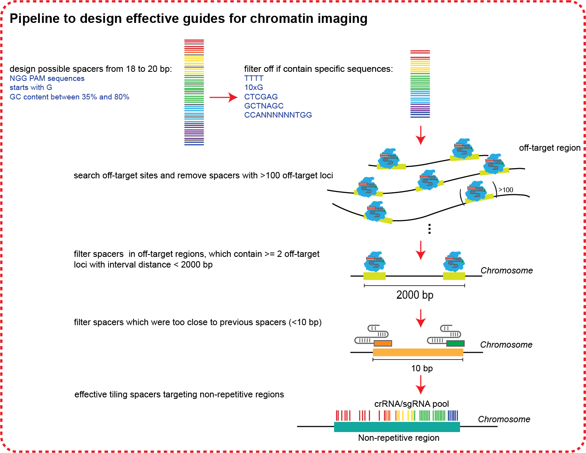

# Oligo-LiveFISH_crRNA_sgRNA_design
The pipeline can design effecitve tiling spacers targeting non-repetitive region for chromatin imaging. The figure visualizes how we desiegn effective guides for chromatin imaging.  

# Instructions
## 1. Create the input file
The input file should be bed format.  
The name in the fourth column has to follow the format: `Name(chr:start-end)`  
   Here's an example of an input file:  
   `chr3	195458317	195478317	Chr3Repeat_LFlanking20K(chr3:195458317-195478317)`
## 2. Design possible spacers
Run `01_run_generate_possible_guides.sh` to generate possible spacers.
## 3. Search for off-target sites using Cas-Offinder
Run the Cas-Offinder tool from https://github.com/snugel/cas-offinder on the spacer sequences generated from first step. Follow the steps from Cas-Offinder to generate the `output.txt` for different lengths of spacers.  
## 4. Filter spacers
Run `04_filter_off_targets_ifnoHF.sh` and `05_remove_sgRNA_offtarget_2_10_sites_tmp.sh` to filter sapcers and obtain final spacer sequence pool.  
## 5. Generate spacer sequence pool
The final output file will be `2SitesInRegion_sgRNA_NoOfftarget_Spacer10.bed`, and here's an example content in the output:

| Chr | Start | End | Spacer Sequence | Score | Strand | Score |
|----------|----------|----------| ----------| ----------| ----------| ----------|
| chr3 | 195458325 | 195458345 | GCAGTCAGTCTCTGCTCTCA | 800 | - | 0.32 |
| chr3 | 195458357 | 195458377 | GCCACATGATAGGGATATGA | 800 | - | 0.42 |
| chr3 | 195458433 | 195458451 | GAAGGAGGGCTGGAGGATT | 800 | + | 0.35 |
| ... |  |  |  |  |  | |

